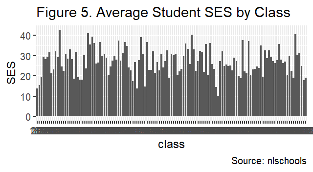
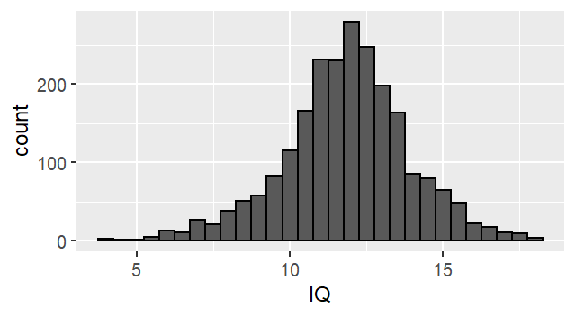
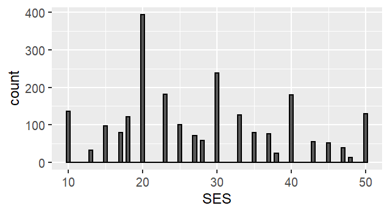
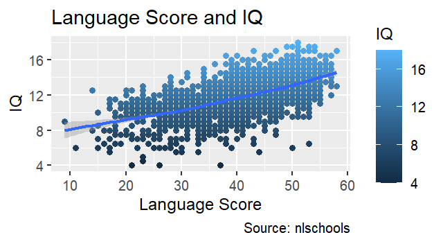
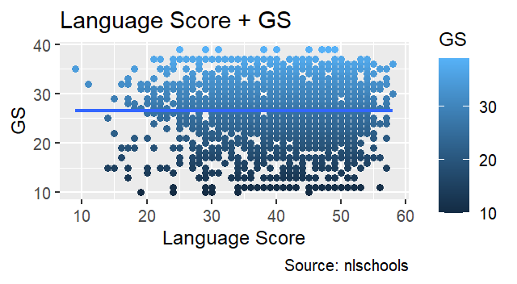
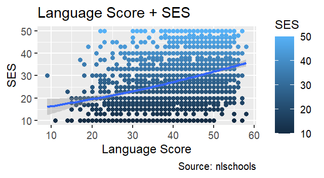
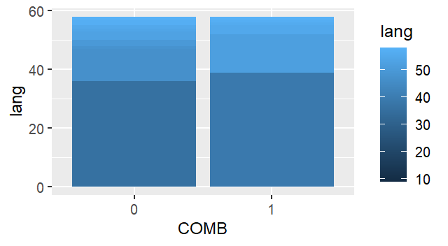
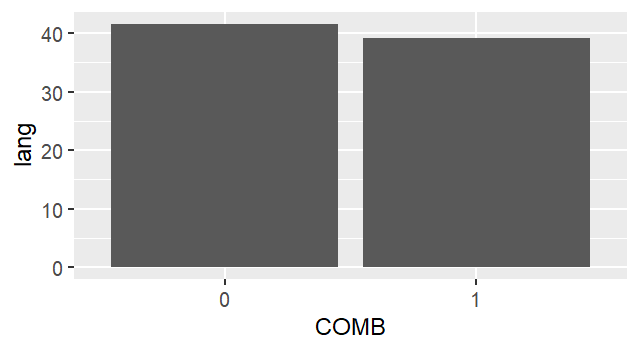

### Instructions 

The data set `nlschools` (in the `MASS` library, use `data(nlschools, package = "MASS")` to load in the data) contains the following records for 2287 students in the Netherlands (see `?nlschools` for more information) 

* `lang`: their test score on a language exam
* `IQ`: their verbal IQ
* `class`: the ID number for their classroom
* `GS`: the number of students in each class
* `SES`: the socio-economic status of their family
* `COMB`: was the student in a multi-grade class? (0=no, 1=yes)

Your task is to explore and describe this data set. You should use both models and visualization. You should use your judgement as to what are the most important aspects of the data to highlight; however, the following questions are of particular interest:

1. Are there discrepancies in `IQ` or `SES` in the different classes, or when grouping by multi-grade vs non-multi-grade classes?
2. When did students perform better or worse on the language exam? Describe which variables had the most important effects. 
3. Do you think there are interactions in the effects of the variables on the language exam score? Speculate as to the cause of any such effects that you think should be included.

Always think about what you are doing -- blindly replicating the lectures may not result in the best analysis! Every data set is different, so you may need to use your judgement on the right thing to do. Your goal is to understand the data as best as your can, particularly in regards to questions 1-3 above.

NOTE: Since this is an observational study, we'll understand that any claims about causality should be taken mainly as speculation or hypothesis. Usage of language regarding the "effects" of a variable on the outcome of interest will be understood to be informal, so we won't penalize you. (This will probably make the report much easier to write.)

### Presentation Requirements

Your output should be this rmarkdown file, which should compile into a report that gives your analysis. 

The report should be understandable. One possible outline is: 

1. Intro: what are your main steps, and what are your findings?
2. Analysis: Describe each step and why you did it, show the R code and results, then comment on the results.
3. Conclusions: recap and summarize 

Typically, it's best to do step 2 first, and then write step 1 and 3 after you are finished. Bulleted lists may be especially helpful for these parts. 

Code should be clearly commented. All plots should be presentable and properly labeled. Mitigate overplotting whenever possible. When building a model, explain each step so that we know why you are doing it. 

The due date is 11:59pm EST June 28, 2019 (Friday). This is a hard deadline -- no late days may be used. Submit this Rmd file on Canvas Don't submit additional files.

### Report:


```
## 
## Attaching package: 'dplyr'
```

```
## The following object is masked from 'package:MASS':
## 
##     select
```

```
## The following objects are masked from 'package:stats':
## 
##     filter, lag
```

```
## The following objects are masked from 'package:base':
## 
##     intersect, setdiff, setequal, union
```

#### Introduction
The dataset that the Analytics Practitioner will be working on is the nlschools dataset which is a study of 2,287 eighth-grade pupils (aged about 11) in 132 classes in 131 schools in the Netherlands conducted by Snijders and Bosker (1999).

To get a glimpse of what the dataset is about, the Analytics Practitioner determined the average values of some attributes as detailed below:

1. The dataset has 2287 rows.
2. The average language exam test score of all the students is 40.9348491.
3. The standard deviation of the students' language exam is 9.003676.

The below tables show the summary of the nlschools dataset.


```r
# Dataset Summary
summary(nlschools)
```

```
##       lang             IQ            class            GS             SES       
##  Min.   : 9.00   Min.   : 4.00   15580  :  33   Min.   :10.00   Min.   :10.00  
##  1st Qu.:35.00   1st Qu.:10.50   5480   :  31   1st Qu.:23.00   1st Qu.:20.00  
##  Median :42.00   Median :12.00   15980  :  31   Median :27.00   Median :27.00  
##  Mean   :40.93   Mean   :11.83   16180  :  31   Mean   :26.51   Mean   :27.81  
##  3rd Qu.:48.00   3rd Qu.:13.00   18380  :  31   3rd Qu.:31.00   3rd Qu.:35.00  
##  Max.   :58.00   Max.   :18.00   5580   :  30   Max.   :39.00   Max.   :50.00  
##                                  (Other):2100                                  
##  COMB    
##  0:1658  
##  1: 629  
##          
##          
##          
##          
## 
```

```r
# Summary
# summary <- data %>%
#     group_by(class, GS, COMB) %>%
#     summarise(avg.lang = mean(lang), avg.iq = mean(IQ), avg.ses = mean(SES))
# print(as_tibble(summary), n=133)
# # 
# Average Language Exam per class
# avg.class.lang <- data %>%
#     group_by(COMB) %>%
#     summarise(avg.lang = mean(lang), avg.iq = mean(IQ), avg.ses = mean(SES))
# print(as_tibble(avg.class.lang), n=100)
```


#### Body
Now, to expound on the summary of the dataset, the Analytics Practitioner will answer the questions posed with the help of graphs and charts.


1. Are there discrepancies in `IQ` or `SES` in the different classes, or when grouping by multi-grade vs non-multi-grade classes?


```r
# Discrepancies by Class
class.disc <- data %>%
    group_by(class, GS) %>%
    summarise(avg.IQ = mean(IQ), sd.IQ = sd(IQ), avg.SES = mean(SES), sd.ses = sd(SES), avg.lang = mean(lang), sd.lang = sd(lang))
```

```
## `summarise()` has grouped output by 'class'. You can override using the
## `.groups` argument.
```

```r
# Class with the highest number of students
head(select(
  as_tibble(class.disc %>% 
    arrange(desc(GS))), class, GS, avg.lang, sd.lang), n=5)
```

```
## # A tibble: 5 x 4
##   class    GS avg.lang sd.lang
##   <fct> <int>    <dbl>   <dbl>
## 1 15680    39     39      8.38
## 2 19980    37     34.5    8.75
## 3 24280    37     43.3    8.28
## 4 16180    36     46.0    7.69
## 5 1580     35     30.9   13.3
```

```r
# Class with the lowest number of students
tail(as_tibble(class.disc %>%
    arrange(desc(GS))), n=5)
```

```
## # A tibble: 5 x 8
##   class    GS avg.IQ sd.IQ avg.SES sd.ses avg.lang sd.lang
##   <fct> <int>  <dbl> <dbl>   <dbl>  <dbl>    <dbl>   <dbl>
## 1 24480    13  11.1  2.19     19.2   3.95     37.8    9.98
## 2 4082     11  13.1  2.07     28.3   9.83     45.2    6.18
## 3 18280    11   9.22 2.09     10     0        34.9    6.64
## 4 20680    11  12.8  0.905    22.3   5.27     45.6    6.04
## 5 17980    10  11.2  1.33     14.5   5.05     30.2    8.93
```

```r
# Class with the highest IQ Average
print(as_tibble(class.disc %>%
    arrange(desc(avg.IQ))), n=5)
```

```
## # A tibble: 133 x 8
##   class    GS avg.IQ sd.IQ avg.SES sd.ses avg.lang sd.lang
##   <fct> <int>  <dbl> <dbl>   <dbl>  <dbl>    <dbl>   <dbl>
## 1 9480     25   13.7  2.40    34.7   9.88     47      6.13
## 2 6280     26   13.6  2.15    36.7  10.5      46.8    5.22
## 3 12180    23   13.6  1.54    30.5   9.29     40.6    8.41
## 4 19780    35   13.6  1.83    27.2   4.79     45.3    7.79
## 5 2980     22   13.4  3.42    42.7   6.02     46.5    6.22
## # ... with 128 more rows
```

```r
# Class with the lowest IQ Average
tail(as_tibble(class.disc %>%
    arrange(desc(avg.IQ))), n=5)
```

```
## # A tibble: 5 x 8
##   class    GS avg.IQ sd.IQ avg.SES sd.ses avg.lang sd.lang
##   <fct> <int>  <dbl> <dbl>   <dbl>  <dbl>    <dbl>   <dbl>
## 1 1280     31   9.43  1.25    29.5   9.46     30.9    6.97
## 2 18280    11   9.22  2.09    10     0        34.9    6.64
## 3 280      19   9     2.10    15.4   4.79     23.7    6.32
## 4 4780     15   8.31  2.39    18.1   5.79     23.5    4.78
## 5 10380    29   6.75  2.5     13.8   4.79     20      6.63
```

```r
# Class with the highest SES Average
print(as_tibble(class.disc %>%
    arrange(desc(avg.SES))), n=5)
```

```
## # A tibble: 133 x 8
##   class    GS avg.IQ sd.IQ avg.SES sd.ses avg.lang sd.lang
##   <fct> <int>  <dbl> <dbl>   <dbl>  <dbl>    <dbl>   <dbl>
## 1 2980     22   13.4  3.42    42.7   6.02     46.5    6.22
## 2 5480     32   13.0  1.83    41.1   9.11     45.8    7.34
## 3 24680    32   12.8  1.66    40.4  10.8      45.5    7.85
## 4 15280    17   12.4  1.24    40.2   6.84     48      5.65
## 5 5780     31   12.0  1.94    39.2   8.03     41.6    7.98
## # ... with 128 more rows
```

```r
# Class with the lowest SES Average
tail(as_tibble(class.disc %>%
    arrange(desc(avg.SES))), n=5)
```

```
## # A tibble: 5 x 8
##   class    GS avg.IQ sd.IQ avg.SES sd.ses avg.lang sd.lang
##   <fct> <int>  <dbl> <dbl>   <dbl>  <dbl>    <dbl>   <dbl>
## 1 10980    33  10.8   2.67    14.8   4.83     33.2    6.98
## 2 17980    10  11.2   1.33    14.5   5.05     30.2    8.93
## 3 180      29  10.3   2.56    13.8   4.70     36.4    8.76
## 4 10380    29   6.75  2.5     13.8   4.79     20      6.63
## 5 18280    11   9.22  2.09    10     0        34.9    6.64
```

```r
# Class with the highest Language Score Average
print(as_tibble(class.disc %>%
    arrange(desc(avg.lang))), n=5)
```

```
## # A tibble: 133 x 8
##   class    GS avg.IQ sd.IQ avg.SES sd.ses avg.lang sd.lang
##   <fct> <int>  <dbl> <dbl>   <dbl>  <dbl>    <dbl>   <dbl>
## 1 22880    25   12.4  2.09    27.3   6.77     49.2    4.93
## 2 14780    22   12.7  1.24    23.5   4.82     49.1    5.25
## 3 19380    31   12.7  1.54    25     8.45     48.4    6.19
## 4 15280    17   12.4  1.24    40.2   6.84     48      5.65
## 5 13680    30   12.9  1.07    30.1   9.31     47.4    5.82
## # ... with 128 more rows
```

```r
# Class with the lowest Language Score Average
tail(as_tibble(class.disc %>%
    arrange(desc(avg.lang))), n=5)
```

```
## # A tibble: 5 x 8
##   class    GS avg.IQ sd.IQ avg.SES sd.ses avg.lang sd.lang
##   <fct> <int>  <dbl> <dbl>   <dbl>  <dbl>    <dbl>   <dbl>
## 1 25680    32  10.6   2.33    17.8   8.35     29.3   13.3 
## 2 25880    30  10.6   1.28    19     6.19     28.4    6.97
## 3 280      19   9     2.10    15.4   4.79     23.7    6.32
## 4 4780     15   8.31  2.39    18.1   5.79     23.5    4.78
## 5 10380    29   6.75  2.5     13.8   4.79     20      6.63
```




2. When did students perform better or worse on the language exam? Describe which variables had the most important effects.


```
## `geom_smooth()` using formula 'y ~ s(x, bs = "cs")'
## `geom_smooth()` using formula 'y ~ s(x, bs = "cs")'
```

```
## `geom_smooth()` using method = 'gam' and formula 'y ~ s(x, bs = "cs")'
```

```
## # A tibble: 2 x 8
##   COMB  avg.IQ sd.IQ avg.SES sd.ses avg.lang sd.lang count.lang
##   <fct>  <dbl> <dbl>   <dbl>  <dbl>    <dbl>   <dbl>      <int>
## 1 0       11.9  2.05    28.1   11.0     41.6    8.51       1658
## 2 1       11.7  2.11    27.0   10.6     39.2   10.0         629
```




3. Do you think there are interactions in the effects of the variables on the language exam score? Speculate as to the cause of any such effects that you think should be included.


#### Conclusion

